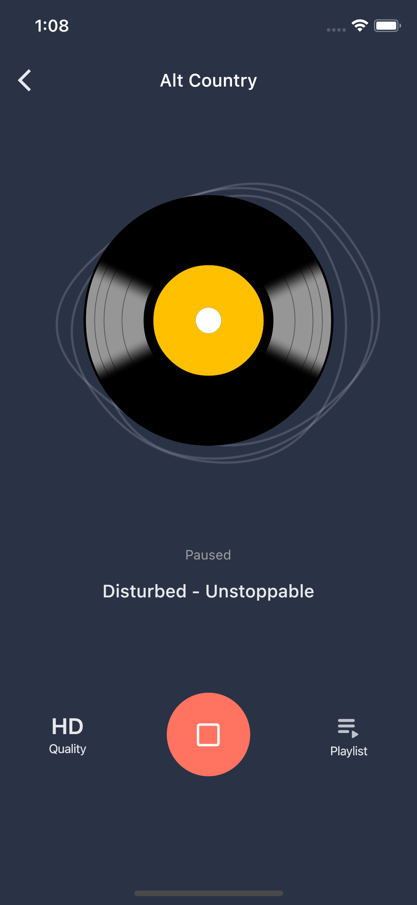
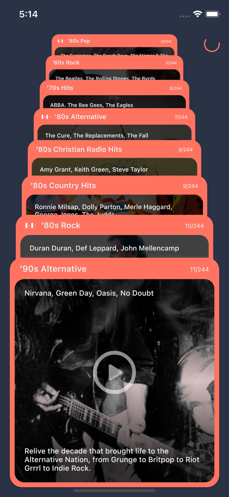
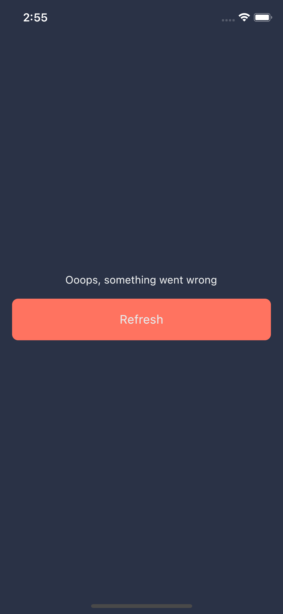

# Radio - Flutter UI Challenge


# Result

 | With station image| Without station image |
 |-------------------|-----------------------|
 || |

 | Stations | Pagination | 
 |------------|------------|
 |||

 | Error    |
 |----------|
 ||

 


# Features
* BLoC
* Retrofit
* Custom linter
* CI
* Tests


# Instructions

Models serialization:
```
flutter pub run build_runner build
```

Run tests:
```
flutter test test    
```